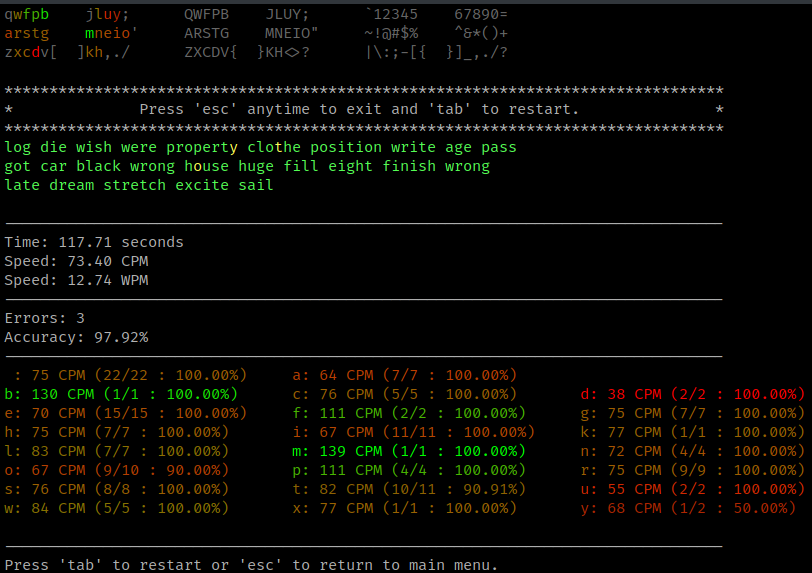

# Typerl
A touch-typing trainer written with perl

# Todo list:
- [] lists names function of parameters.

- [] fix layout help after backspace
- [] fix wpm for incomplete test

# Notes:
## CSV export:
You can export basics csv datas for a session adding a filename as script argument (e.g. typerl qwerty.csv)
The datas exported are date, wpm and accuracy. You'll can then import them into your favorite spreadsheet program.

## Colors:

### Typing:
- correctly typed:
    - with a metronome the color is proportional to `cpm / bpm`
    - with a metronome the cholor is simply green
- badly typed, the color is red
- keys which was typed again with backspace are yellow.

### Results:
- The characters are colorized proportionally to `key_average_cpm / average_cpm`
- The red composant is also proportional to key_accuracy

# Random texts

# Results:

# Layouts
You can set a keyboard layout to help you discover layouts and layers.
Layouts are defined in `res/layouts.json`.
If you add commonly used layouts, you're welcome to pull a request.

# Dependencies
The modules used are:
- POSIX
- FindBin
- JSON
- File::Which
- Time::HiRes
- Term::ReadKey
- Term::ReadLine
- Term::ReadLine::Gnu
- List::Util
