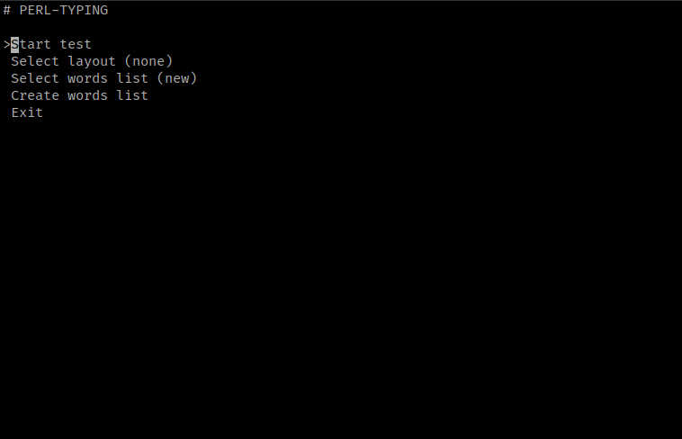

# perl-typing
A touch-typing trainger written with perl

# Dependancies
The modules used are:
- Term::ReadKey
- Term::ReadLine
- Term::ReadLine::Gnu
- Time::HiRes;
- JSON
- List::Util

# Wordlists

# Layouts
You can set a keyboard layout to help you discover layouts and layers.
Layouts are defined in `res/layouts.json`.
If you add commonly used layouts, you're welcome to pull a request.

